 # Assignment 4

In this file, all questions from the assignment are answered.

## Objective
The objective of this assignment is to understand and analyze a simulation of a pathogen infection in a plant tissue.

## Contributions
All group members contributed equally to this assignment. 

## Answers to the questions: 
1. **Open the model and run it – as it is – for 4h. What is happening? What do you observe?**

a. initial state
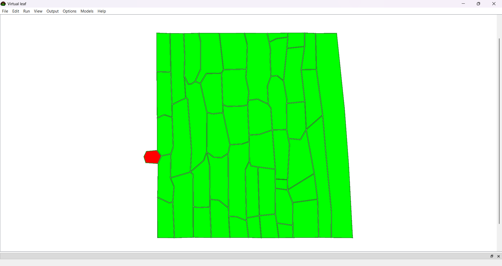

b. after one hour
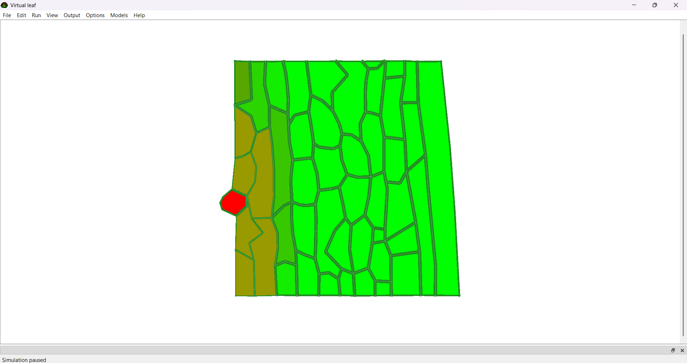

c. after two hours
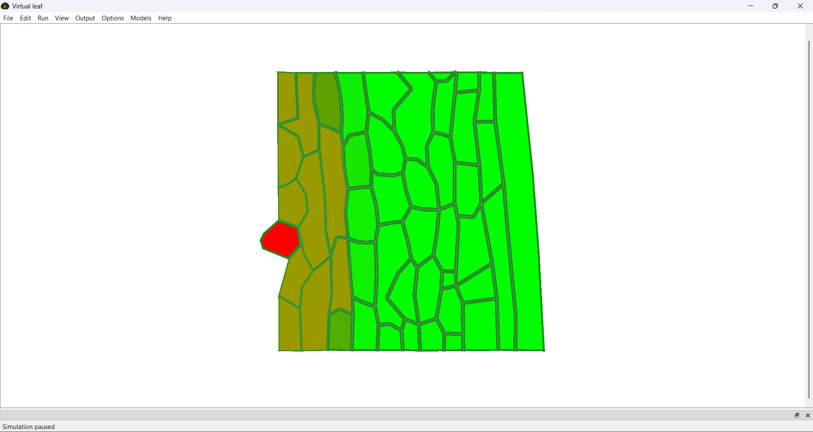

d. after three hours
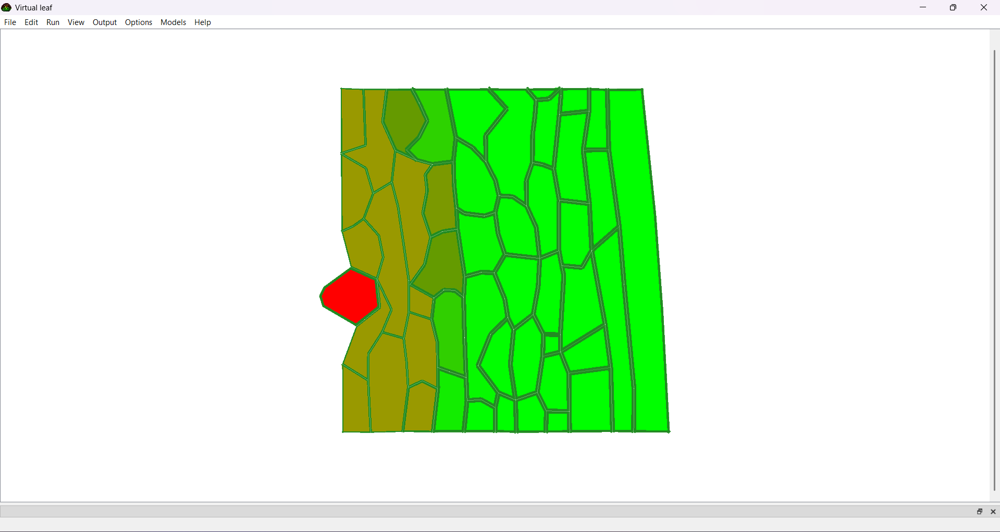

e. after four hours
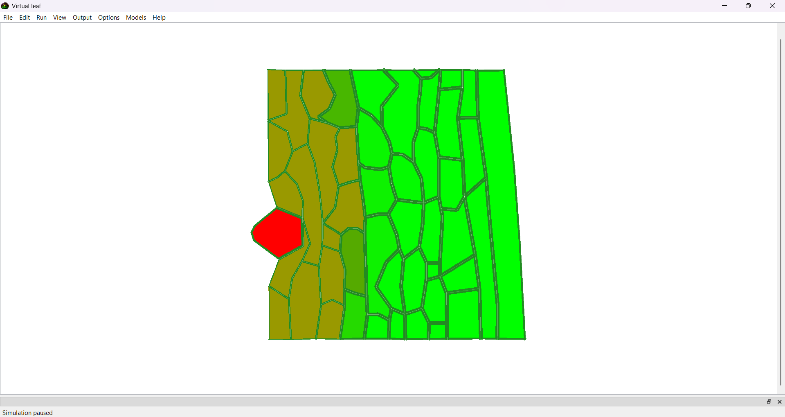


We have a pathogen infection model where the pathogen is represented in red and produces a chemical that weakens the plant cell wall represented in green. We can observe over the course of 4 hours what happens to the plant.

In the beggining we have a healthy plant cell wall. All the cells are organized in a neatly sheet and there is a clear delimitation between them. We can see the begginning of a pathogen cell in red that is making contact with the plant.

After an hour, the infection is starting to spread to the very close neighbouring cells. They start turning a dark green and brownish color meaning the pathogen is slowly getting to them.

After two/three hours, the infections starts spreadin to underlying cells as well, not just the ones in close procimity. the cells start collapsing between each other changing their initial organization. The pathigen also seems to have grwon in size and is reachjing easier to the other cells.

After four hours, the pathogen is significantly bigger and the cells underneath it have been completly damaged. Around the infected area the cells have collapsed and the growing proccess has completly stoped since the whole outside wall is infected and there are no more green cells.

2. **Describe in your own words what the code in this section does (CellHouseKeeping)**

In the CellHouseKeeping we usually keep track of the cell behavior. For example, the cell's growth rate and when it grows. Or the cell's differentiation like when the cell changes its type and what are the conditions of different cell types.

In our case, if the cell is of type 2 (so, a pathogenic fungi), we enlarge the target area. This shows how much it expands in the tissue.
Each cell also monitors a toxin concentration (which is secreted by the pathogen). If the pathogen chemical reaches a high level (a certain threshold), the cell walls will be weakened and the cell wall stability will be reduced, which allows the pathogen to get through. On the other hand, when the chemical concentration is low (below the threshold), the cell walls remain stiff and the pathogen has a harder time getting through.

3. **Cell to cell transport and cell dynamics. Compare the equations to the sketch of the network. What information is missing?**
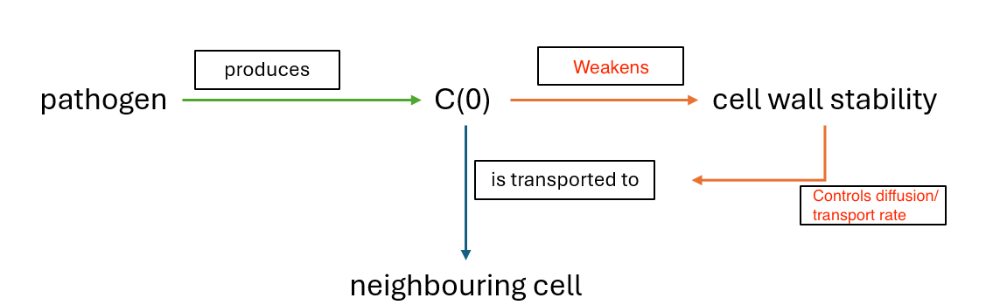

4. **Adjust the diffusion coefficient for the pathogen’s chemical (decrease by a factor of 10, then increase by a factor of 10). Document the simulations and describe in your own words what changes.**

### Case 1: Decrease diffusion coefficient by a factor of 10 (D = 0.000001)

Here are the simulation results when the diffusion coefficient for the pathogen’s chemical was decreased by a factor of 10, compared to the baseline case (D = 0.00001):

a. after one hour  
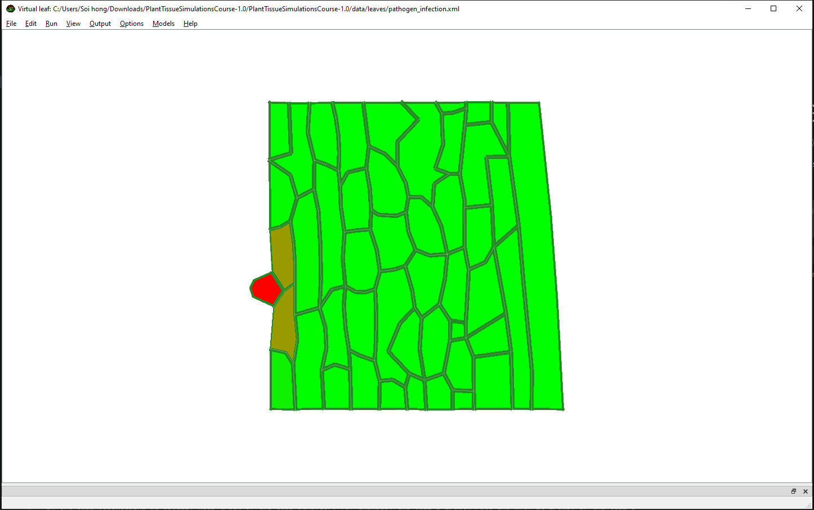  
Only the immediate neighboring cells around the pathogen begin to show weakening. The effect remains very localized.  

b. after two hours  
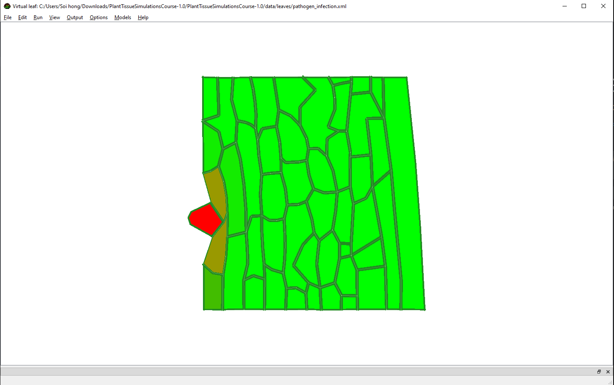  
The brown weakened zone stays narrow, and spread into deeper tissue is minimal.  

c. after three hours  
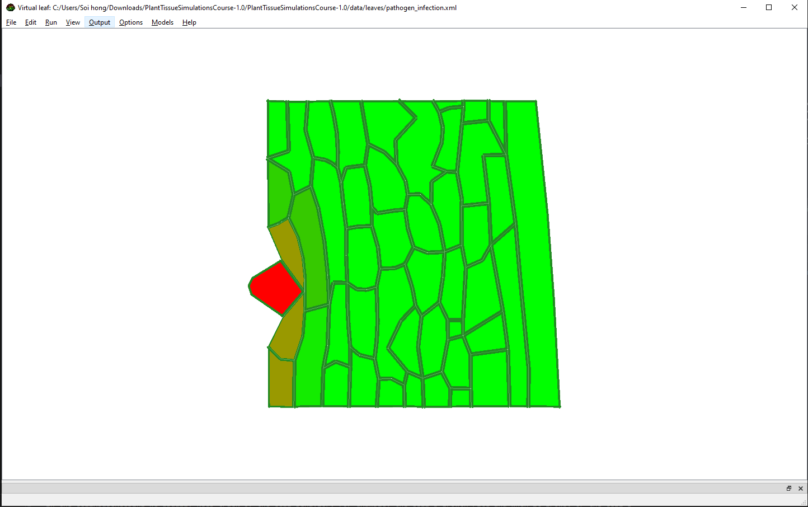  
Infection remains mostly confined to a small region near the pathogen, with little progression compared to the baseline.  

d. after four hours  
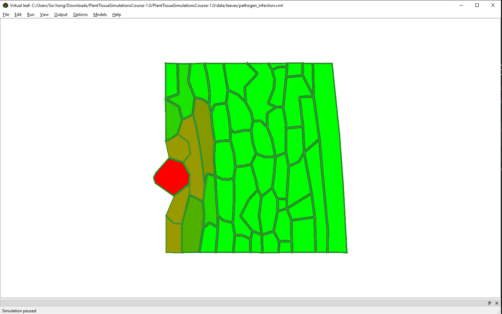  
The infection is still limited to the immediate neighborhood of the pathogen. Most of the tissue remains unaffected.  

Sumary: When the diffusion coefficient of the pathogen’s chemical is decreased by a factor of 10, the spread of infection slows down significantly. The weakening effect on the neighboring plant cells remains much more localized around the initial infected area. Compared to the original simulation, where the brown zone expanded widely, the chemical now diffuses only to immediate neighbors, limiting the pathogen’s reach and reducing the overall extent of infection.


### Case 2: Increase diffusion coefficient by a factor of 10 (D = 0.0001)

Here are the simulation results when the diffusion coefficient for the pathogen’s chemical was increased by a factor of 10, compared to the baseline case (D = 0.00001):

a. after one hour  
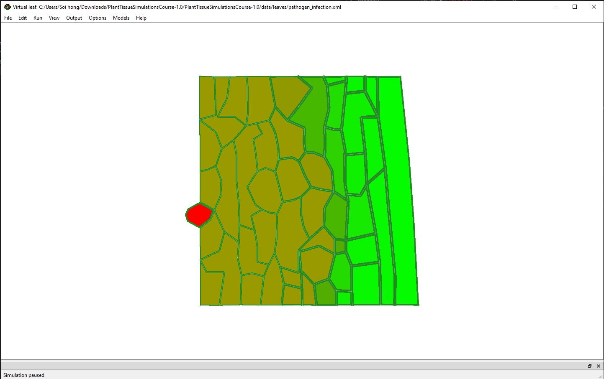  
The pathogen’s chemical spreads quickly into surrounding cells, with early signs of widespread weakening.  

b. after two hours  
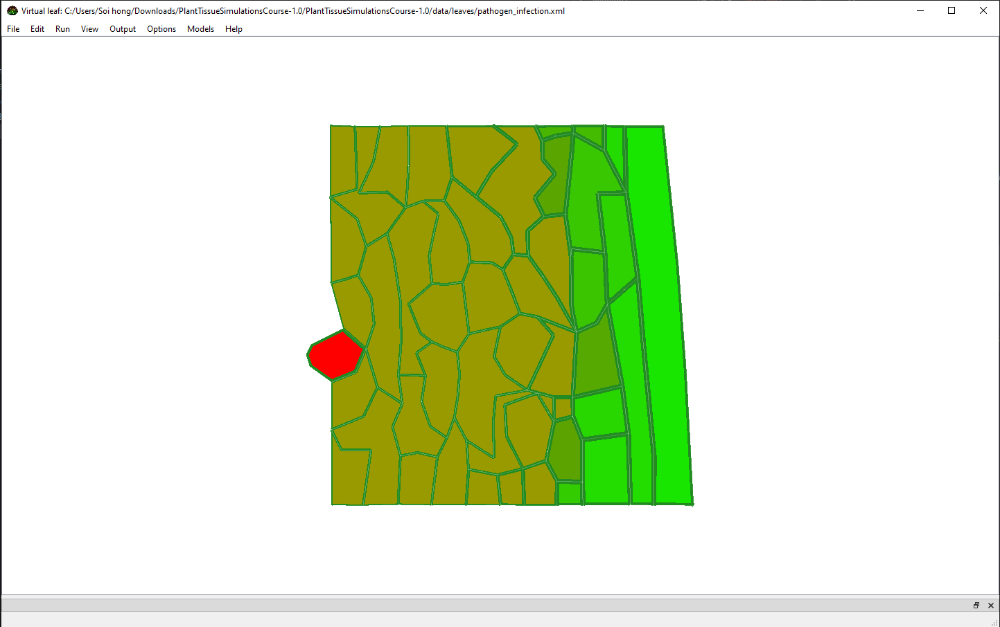  
The brown weakened zone expands rapidly, already reaching far from the original infection site.  

c. after three hours  
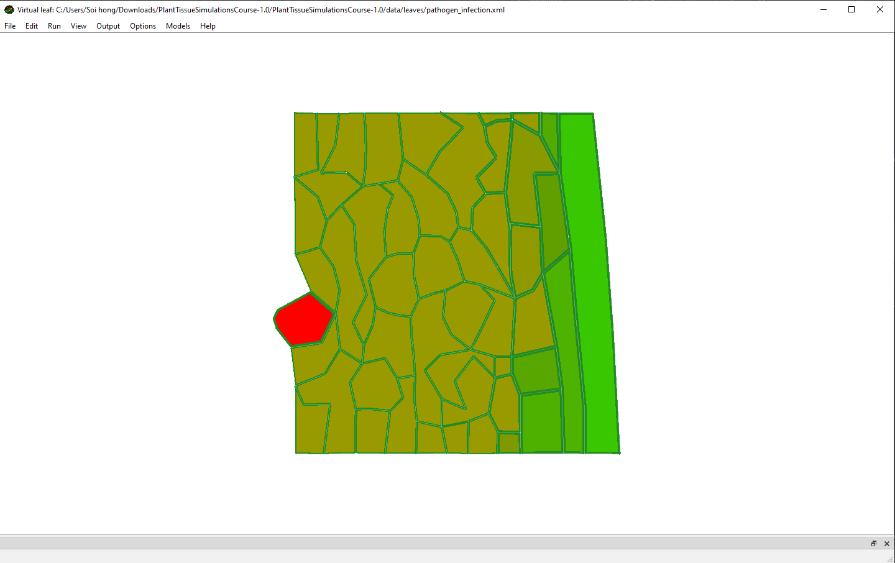  
Most of the surrounding tissue shows signs of collapse. The pathogen advances much faster than in the baseline case.  

d. after four hours  
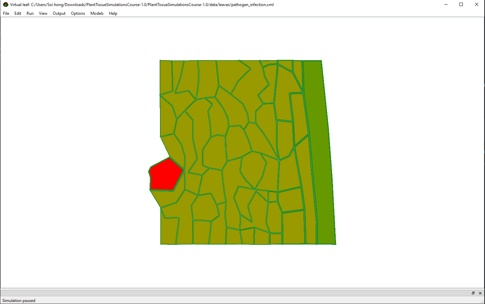  
Nearly the entire section of tissue is affected. Very few healthy (green) cells remain intact.  

Summary: When the diffusion coefficient was increased tenfold, the infection spread significantly faster compared to the original simulation. The pathogen’s chemical diffused more quickly into distant cells, leading to a much larger zone of weakened tissue. While in the original case the infection zone remained moderate, with higher diffusion nearly the entire tissue became affected by 4h. This demonstrates that a higher diffusion coefficient allows the pathogen to overcome spatial barriers more quickly, resulting in rapid and extensive infection.


5. **Let’s suppose the plant has developed a defense mechanism that detects the chemical and triggers a signal for uninfected plant cells to strengthen their cell walls. How could this be implemented in the model?**

**Idea:**  
We extend the model by introducing a plant defense signal `S`. When uninfected plant cells detect a sufficiently high concentration of the pathogen toxin `C`, they start producing `S`. This signal diffuses to nearby cells and temporarily strengthens their walls by increasing wall stability and reducing yielding. The defense has a threshold so that it is only triggered under strong infection pressure, decays over time so it does not stay active forever, and includes a cap to prevent unrealistic infinite stiffening. Optionally, defended cells may also break down `C` more quickly or reduce its diffusion across their walls, further slowing the infection.


### New parameters
| Name | Meaning | Example |
|------|---------|---------|
| `C_DETECT` | Toxin level that triggers defense signal production | 0.15 |
| `K_SIG_PROD` | Production rate of signal `S` | 0.02 |
| `D_SIG` | Diffusion coefficient of `S` | 0.02 |
| `DECAY_SIG` | Decay rate of `S` | 0.01 |
| `S_ON`, `S_OFF` | Thresholds for defense activation ON/OFF | 0.05 / 0.03 |
| `STIFFEN_FACTOR` | Multiplier for wall stability when defended | 2.0 |
| `YIELDING_FACTOR` | Multiplier for yielding (↓ = tougher) | 0.5 |
| `MAX_STABILITY` | Cap on wall stability | 2.5 |
| `C_DEGRADATION_DEF` | Extra breakdown of `C` inside defended cells | 0.01 |
| `D_C_DEF_FACTOR` | Factor to reduce `C` diffusion through defended walls | 0.7 |


### New per-cell state
- `S` (defense signal concentration, new chemical)  
- `defense_state ∈ {0,1}` (flag for defense ON/OFF)  
- *(existing)* `C` (toxin concentration), `cell_type`, `wall_stability`, `yielding_threshold`


### Pseudo-code 

**0. Initialization**
```pseudo
for each cell:
  S[cell] ← 0
  defense_state[cell] ← 0
```

**1. Transport**
```pseudo
diffuse(C, D_C)        # existing toxin diffusion
diffuse(S, D_SIG)      # new defense signal diffusion

# Reduce toxin diffusion across defended walls
for each wall between cells i and j:
  if defense_state[i] == 1 or defense_state[j] == 1:
      effective_D_C = D_C * D_C_DEF_FACTOR
  else:
      effective_D_C = D_C
```

**2. Production & decay**
```pseudo
for each cell:
  if C[cell] ≥ C_DETECT:
      S[cell] += K_SIG_PROD * dt
  S[cell] -= DECAY_SIG * S[cell] * dt
  S[cell] = max(S[cell], 0)
```

**3. CellHouseKeeping**
```pseudo
for each plant cell:
  # toggle defense state using hysteresis thresholds
  if defense_state == 0 and S ≥ S_ON: defense_state = 1
  if defense_state == 1 and S ≤ S_OFF: defense_state = 0

  # apply defense effects
  if defense_state == 1:
      wall_stability = min(base_wall_stability * STIFFEN_FACTOR, MAX_STABILITY)
      yielding_threshold = base_yielding * YIELDING_FACTOR
      C[cell] -= C_DEGRADATION_DEF * C[cell] * dt   # optional detoxify
  else:
      wall_stability = base_wall_stability
      yielding_threshold = base_yielding

```
**4. Pathogen growth**:
Where pathogen invasion depends on low wall stability, defended cells are harder to infect. As a result, the spread of red infected cells will slow down.


### Expected effect:
With defense enabled, the weakened zone stays narrower and pathogen spread slows. A halo of defended cells forms around the infection, containing the pathogen more effectively than in the baseline case. Compared to the original simulation without defense, fewer cells collapse, the infection front advances more slowly, and healthy growth is preserved in a larger part of the tissue.
